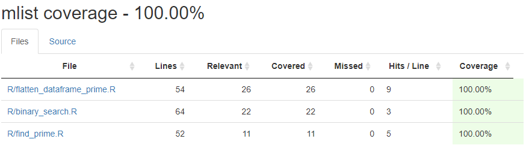

## Contributors

|Name|Github.com User Id|
|--|--|
|Bailey Lei (baileyle)|[blei7](https://github.com/blei7)|
|Daniel Lin (dglin)|[danielglin](https://github.com/danielglin)|
|Fan Wu (fwu03)|[fwu03](https://github.com/fwu03)|

## Versions
| Document | Description |
|-|-|
| [Milestone 1](https://github.com/UBC-MDS/mlist_R/tree/v1.0) | Project Proposal |
| [Milestone 3](https://github.com/UBC-MDS/mlist_R/tree/v2.0) | Milestone 3 |


## Package Overview

R provides lots of tools to manipulate vectors. In this package, we will implement several vector manipulating functions, including `binary_search()`, `flatten_list_prime()`, and `find_prime()`.

## Installation

Install `mlist` by using the R console command:

```
devtools::install_github("UBC-MDS/mlist_R")
```
## Usage

To load the `mlist` library by using the R console command:

```
library(mlist)
```

After loading the mlist package, you can call the functions.

## Testing Branch Coverage with `covr` package

1. Install `covr` by using the R console command:

```
install.packages("covr")
```

2. Load the `covr` library by using the R console command:

```
library(covr)
```

3. Get branch coverage summary by using the R console command:

```
report()
```

The result suggest 100% test coverage:



## Travis: Continuous Integration Testing

## Functions

|ID|Function|Description|Arguments|Example|
|--|--|--|--|--|
|1|binary_search(x, lst)|Search if the value `x` exists in the `lst`, and return a vector contains: `TRUE/FALSE` depends on whether the `x` value has been found, `x` value, and `x` position index in `lst`.|x: numeric, lst: sorted vector of numerics|binary_search(4, c(1,2,3,4,5,6))|
|2|flatten_dataframe_prime(dataframe)|This function takes a dataframe contains multiple vectors and returns a flat vector that contains only prime numbers.|dataframe: a dataframe contains multiple vectors of numerics|flatten_dataframe_prime(data.frame(c(2, 3, 4), c(5, 6, 7), c(8, 9, 10)))|
|3|find_prime(x)| Return the largest prime number for a given list.|x : a vector of numerics|find_prime(c(0,1,2,3,4,5))|

## R Environment

1. binary_search(x, lst): In the R environment, there are two functions have the similar functionality as binary_search. The first one is [findintervals](https://www.rdocumentation.org/packages/pracma/versions/1.9.9/topics/findintervals), which returns the position indices of a numeric value in a numeric vector. Another one is the operator `%in%` which is used to identify if an element belongs to a vector. Comparing with them, the binary_search function is able to return a list contains whether `x` is in the `list`, `x` value, `x` position indices in `list`.

2. flatten_dataframe_prime(dataframe): There is no function that returns the prime numbers in a dataframe.

3. find_prime(list): There is no function that find the largest prime for a given vector, but there is similar function in R environment, such as [isprime](https://www.rdocumentation.org/packages/gmp/versions/0.5-13.2/topics/isprime), that test if a number is a prime or not.

## Dependencies

- R (≥ 3.0.2)
- testthat (≥ 2.0.1)
- covr
